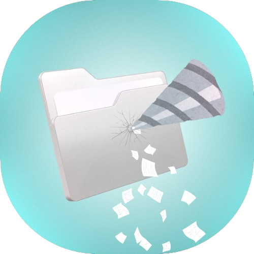

<p align="center">
  
</p>

<h1 align="center">PathDrill</h1>

<p align="center">
  <em>A high-performance Python desktop utility for fast, focused directory scanning and structured data extraction.</em>
</p>

<p align="center">
  <em>Yüksek performanslı, hızlı ve odaklı dizin tarama ve yapılandırılmış veri çıkarımı için Python masaüstü aracı.</em>
</p>

<p align="center">
  <a href="#-about-the-project">🇬🇧 English</a> •
  <a href="#-proje-hakkında">🇹🇷 Türkçe</a>
</p>

---

## 📌 About The Project

PathDrill was born out of a practical necessity: the need to quickly parse through massive directories, identify specific file patterns, and extract structural data without dealing with sluggish, resource-heavy tools.

Unlike standard command-line utilities or overly complex commercial software, PathDrill provides a clean GUI with an underlying multithreaded architecture. It is designed to get in, drill down to the required depth, extract the necessary paths or file metrics, and get out—saving significant time in daily development and data management workflows.

---

## 📸 Preview

Here is a glimpse of the user interface and the scanning engine in action:

<p align="center">
  
</p>

---

## ✨ Core Features

* **Interactive GUI (PySide6):** A clean, intuitive graphical interface featuring a live directory tree and responsive configuration panels.

* **Multithreaded Scan Engine:** Deep directory traversals run on a separate background thread, ensuring the UI remains responsive and memory consumption stays low.

* **Granular Depth Control:** Customize the exact recursion depth (spin_depth) to prevent unnecessary scanning of deeply nested, irrelevant subfolders.

* **Structured Data Export:** Easily export the extracted drill data into various structured formats (CSV, JSON, etc.) for further analysis.

---

## 🚀 Installation & Usage

PathDrill is built with Python. To run it locally, follow these steps:

### 1. Clone the repository

```bash
git clone https://github.com/Bedirhan-thinking/PathDrill.git
cd PathDrill
```

### 2. Install the dependencies

It is highly recommended to use a virtual environment.

```bash
pip install -r requirements.txt
```

### 3. Run the application

```bash
python PathDrill.py
```

---

## 🤝 Contributing

PathDrill is open to any contributions that aim to optimize the codebase, improve the scanning algorithm, or extend export capabilities.

If you spot a bug or have a feature request, feel free to open an Issue.

If you want to contribute directly to the code, please fork the repository and submit a Pull Request (PR).

---

## 📄 License

This project is licensed under the MIT License. You are free to inspect, modify, and integrate the code into your own projects. See the license file in the repository for more details.

---

# 🇹🇷 Proje Hakkında

PathDrill, pratik bir ihtiyaçtan doğmuştur: büyük dizinleri hızlıca analiz etmek, belirli dosya desenlerini tespit etmek ve ağır, kaynak tüketen araçlara ihtiyaç duymadan yapısal verileri çıkarmak.

Standart komut satırı araçlarının veya karmaşık ticari yazılımların aksine, PathDrill temiz bir GUI ve çok iş parçacıklı (multithreaded) bir mimari sunar. Amaç; hızlıca içeri girip, gerekli derinliğe inmek, gerekli veriyi çıkarmak ve çıkmaktır — böylece günlük geliştirme ve veri yönetimi süreçlerinde ciddi zaman tasarrufu sağlar.

---

## 📸 Önizleme

Arayüzün ve tarama motorunun çalışmasına kısa bir bakış:

<p align="center">
  
</p>

---

## ✨ Temel Özellikler

* **Etkileşimli Arayüz (PySide6):** Canlı dizin ağacı ve hızlı tepki veren ayar panelleri içeren sade ve anlaşılır bir GUI.

* **Çok İş Parçacıklı Tarama Motoru:** Derin dizin taramaları arka planda çalışır, böylece arayüz donmaz ve bellek kullanımı düşük kalır.

* **Hassas Derinlik Kontrolü:** Gereksiz alt klasör taramalarını önlemek için tarama derinliğini (spin_depth) ayarlayabilirsiniz.

* **Yapılandırılmış Veri Dışa Aktarımı:** Elde edilen verileri CSV, JSON gibi formatlarda kolayca dışa aktarabilirsiniz.

---

## 🚀 Kurulum ve Kullanım

PathDrill Python ile geliştirilmiştir. Yerel olarak çalıştırmak için:

### 1. Depoyu klonlayın

```bash
git clone https://github.com/Bedirhan-thinking/PathDrill.git
cd PathDrill
```

### 2. Bağımlılıkları yükleyin

Sanal ortam kullanmanız önerilir.

```bash
pip install -r requirements.txt
```

### 3. Uygulamayı çalıştırın

```bash
python PathDrill.py
```

---

## 🤝 Katkıda Bulunma

Kod tabanını optimize etmek, tarama algoritmasını geliştirmek veya dışa aktarma yeteneklerini artırmak isteyen tüm katkılara açıktır.

Bir hata bulursanız veya özellik öneriniz varsa Issue açabilirsiniz.

Doğrudan katkı sağlamak için repo'yu fork edip Pull Request (PR) gönderebilirsiniz.

---

## 📄 Lisans

Bu proje MIT Lisansı ile lisanslanmıştır. Kodu inceleyebilir, değiştirebilir ve kendi projelerinize entegre edebilirsiniz. Detaylar için lisans dosyasına bakınız.
