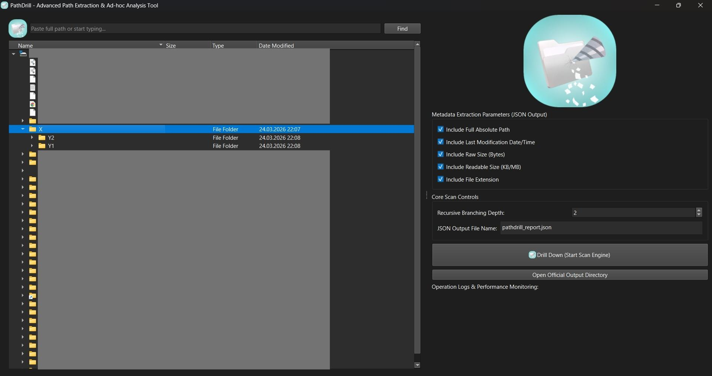

# PathDrill

> ⚠️ This project was developed as an experimental and rapid prototyping effort, focusing on performance and usability.

**A fast and efficient file path extraction and hierarchy mapping tool for Windows.**
Built with Python and PySide6.

PathDrill is designed to explore and analyze complex directory structures with ease. It allows you to scan folders deeply, extract useful metadata (such as file size, modification date, and extensions), and export everything into various structured formats.

Under the hood, it uses `os.scandir` for high-performance traversal, making it capable of handling thousands of nested directories without significant memory overhead.

---

## ✨ Features

* **Built-in File Explorer**
  Navigate your filesystem through a fast and responsive interface with full access to local drives.

* **Deep Directory Scanning**
  Efficient multi-threading ensures smooth performance, even when working with large and deeply nested folders.

* **Adjustable Scan Depth**
  Control how deep the scan goes to avoid unnecessary processing.

* **Multi-Format Export Strategy**
  Export your filesystem topology in multiple formats depending on your needs:

  * **JSON (Default):** Complete, lossless hierarchical data structure
  * **CSV:** Flattened 2D matrix ideal for Pandas, Excel, and SQL ingestion
  * **TXT:** Visual ASCII tree representation (similar to the terminal `tree` command)
  * **MD:** Markdown-formatted lists with folder/file icons for easy reading on GitHub or Notion

* **Parametric Metadata Extraction**
  Dynamically choose to include:

  * OS-native absolute paths
  * ISO 8601 formatted timestamps
  * Human-readable file sizes and raw byte precision
  * File extensions

---

## 📸 Screenshot




---

## 🧪 Example Outputs

### JSON Format (Data Structure)

```json
{
    "scan_results": [
        {
            "name": "src",
            "full_path": "C:\\Project\\src",
            "type": "directory",
            "contents": [
                {
                    "name": "main.py",
                    "full_path": "C:\\Project\\src\\main.py",
                    "size_readable": "2.50 KB",
                    "type": "file"
                }
            ]
        }
    ]
}
```

### TXT Format (Visual Tree)

```txt
├── src (0 B)
│   └── main.py (2.50 KB)
├── assets (0 B)
│   └── logo.png (150.00 KB)
└── README.md (1.20 KB)
```

### Markdown (MD) Format

```md
📁 src

📄 main.py (2.50 KB)

📁 assets

📄 logo.png (150.00 KB)

📄 README.md (1.20 KB)
```

---

## 🚀 Getting Started

### 1. Clone the repository

```bash
git clone https://github.com/Bedirhan-thinking/PathDrill.git
cd PathDrill
```

### 2. Install dependencies

```bash
pip install -r requirements.txt
```

### 3. Run the application

```bash
python PathDrill.py
```

---

## 📦 Building a Standalone Executable

You can package PathDrill into a single `.exe` file using PyInstaller:

```bash
pip install pyinstaller
pyinstaller --noconsole --onefile --icon=icon.ico PathDrill.py
```

The compiled executable will be available in the `dist` directory.

---

## 🤝 Contributing

Contributions, ideas, and feedback are always welcome.
Feel free to open an issue or submit a pull request.
